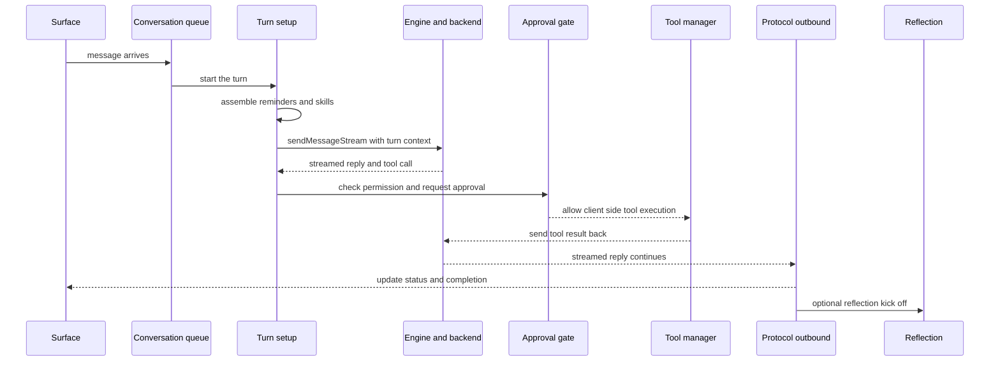

# Anatomy of a Turn

This page explains how one ordinary user message moves through Letta Code, the Letta agent harness, from arrival to streamed reply completion. It gives the mental model behind the turn lifecycle so the reader can see why the harness queues work, rebuilds context, hands off to the engine, and then closes the loop again.

A single message can enter through `src/headless.ts`, `src/websocket/listener/inbound-dispatch.ts`, or `src/channels/processor.ts`. The entry point matters less than the shape that follows: the harness turns the input into a queued turn, keeps it ordered inside one conversation, and then rebuilds only the context that belongs to this run.

## Arrival and queueing

`dispatchInboundMessageWhenReady` decides whether the harness can process a message now or must place it behind work that already belongs to the same conversation. `QueueRuntime` in `src/queue/queue-runtime.ts` serializes turns per conversation, and `src/websocket/listener/conversation-runtime.ts` attaches that queue to the conversation-scoped runtime so the listener can keep the queue, status, and approval state in one place.

This design solves a simple problem: a conversation can receive messages faster than the model can answer them. The queue lets the harness preserve order without blocking the whole listener process, and the protocol surface can still show a clear snapshot of what is waiting.

The queue and interrupt mechanics live in [02 conversations, queues, and interrupts](./02-conversations-queues-and-interrupts.md), so this page keeps only the turn-level view. The channel path uses the same idea. `buildChannelTurnSource` in `src/channels/processor.ts` captures the channel, thread, and conversation identity that the turn needs later, so channel traffic enters the same lifecycle without losing provenance. The channel framing belongs in [07 channels](./07-channels.md).

## The turn in motion

## Turn setup rebuilds the world

`prepareListenerTurn` in `src/websocket/listener/turn-setup.ts` does not trust the last turn to carry forward the right state. It warms the listener, refreshes agent metadata, rebuilds the reminder payload, and prepares tool context from the current conversation, permission state, working directory, and skill sources.

That fresh start solves the hardest part of turn handling: the model needs the current world, not a stale copy of the previous turn. The shared reminder system in `src/reminders/engine.ts` pulls in agent info, secrets, session context, permission mode, command history, and memory sync reminders from durable sources. Skills enter through the reminder path and the trailing user-message path in `src/websocket/listener/skill-injection.ts`; they act as reminders and system context, not as memory blocks. The memory model itself belongs in [03 memory blocks and the memory filesystem](./03-memory-blocks-and-the-memory-filesystem.md) and the official [memory docs](/letta-agent/memory). The skills and subagents story belongs in [05 skills, subagents, and mods](./05-skills-subagents-and-mods.md).

The harness uses that same rebuild step in headless mode, too. `src/headless.ts` sends messages through the same turn model even when no websocket listener sits in front of it, so the CLI path and the device-mode path share the same logic instead of drifting apart.

## Streaming, tools, and approvals

`sendMessageStream` in `src/agent/message.ts` is the handoff into the engine and backend. It freezes a turn-scoped tool snapshot, adds client skills, and sends the request with only the context that belongs to this turn. That design keeps the stream stable even when the global tool registry changes while the model still thinks.

The loop status story in `src/types/protocol_v2.ts` reads as a progression rather than as a raw enum dump: the harness sends the request, waits for the model, retries when recovery asks for another attempt, processes the streamed answer, executes a client-side tool, waits on approval when a protected action needs consent, and returns to waiting on input when the turn ends. `src/websocket/listener/turn-lifecycle.ts` makes that abstract progression concrete with a small state machine that moves between idle, command, active, and cancelling states.

`src/tools/manager.ts` decides which tools the model can see, which ones need approval, and which ones the harness can execute locally. `checkToolPermission` and `getToolApprovalPolicy` keep the policy close to the tool definition, while `src/websocket/listener/approval.ts` turns a protected tool call into a pause, sends the approval request over the websocket, and resumes the turn only after a decision arrives. The permission model belongs in [06 tools, permissions, and sandboxing](./06-tools-permissions-and-sandboxing.md) and the official [permissions docs](/letta-agent/permissions).

The listener does not hide these transitions from the surface. `src/websocket/listener/protocol-outbound.ts` emits loop status, queue snapshots, device status, and streamed deltas as the turn changes, so the UI can render the lifecycle as live state instead of waiting for a final answer. The protocol contract itself lives in [08 the app server and the SDK](./08-the-app-server-and-the-sdk.md) and the official [protocol lifecycle docs](/letta-agent/app-server/protocol-lifecycle).

## Completion closes the loop

`src/websocket/listener/protocol-outbound.ts` and `src/websocket/listener/turn-completion.ts` close the turn after the reply finishes. `completeSuccessfulListenerTurn` emits the end event, appends transcript deltas, enqueues any follow-up continue text, and can launch post-turn reflection in the background. That background pass can rewrite memory after the turn, and the reflection story belongs in [04 dreaming and reflection](./04-dreaming-and-reflection.md).

When the model returns nothing or the run fails, `src/agent/turn-recovery-policy.ts` decides whether the harness retries, recovers a paused approval, or gives up. That recovery path keeps empty replies and transient backend errors from looking like hard failures when a second attempt can still produce a useful answer.

`TurnLifecycle` and the outbound protocol layer finish the job together. One object keeps the turn state honest inside the listener, and the other tells the surface which part of the lifecycle it should show right now.

## Where to look in the code

- Entry points and inbound routing — `src/headless.ts`, `src/websocket/listener/inbound-dispatch.ts`, `src/channels/processor.ts`
- Queueing and conversation scope — `src/queue/queue-runtime.ts`, `src/websocket/listener/conversation-runtime.ts`
- Fresh turn setup and reminders — `src/websocket/listener/turn-setup.ts`, `src/reminders/engine.ts`, `src/websocket/listener/skill-injection.ts`
- Streaming request and tool context — `src/agent/message.ts`, `src/tools/manager.ts`
- Approvals, lifecycle, and protocol state — `src/websocket/listener/approval.ts`, `src/websocket/listener/protocol-outbound.ts`, `src/websocket/listener/turn-lifecycle.ts`, `src/types/protocol_v2.ts`
- Turn completion and recovery — `src/websocket/listener/turn-completion.ts`, `src/agent/turn-recovery-policy.ts`