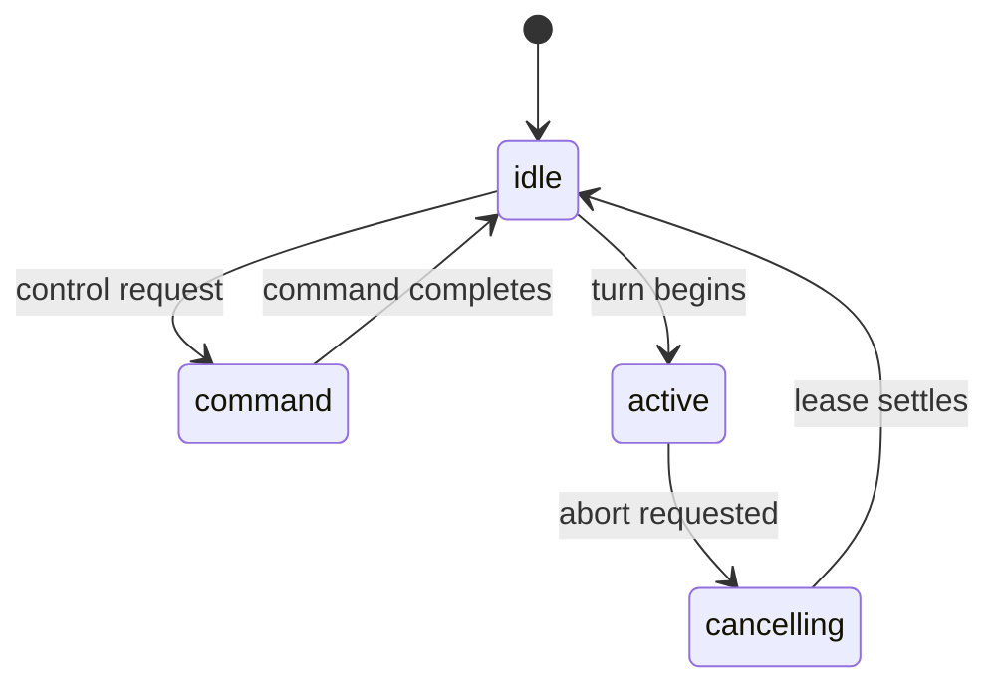

# Conversations, Queues, and Interrupts

This page picks up where [Anatomy of a Turn](./01-anatomy-of-a-turn.md) ends. It explains how Letta Code keeps many conversations ordered while one long-lived agent runs them, how the listener interrupts a live turn without losing state, and how cron work joins the same queue. For durable memory, see [Memory Blocks and the Memory Filesystem](./03-memory-blocks-and-the-memory-filesystem.md) and the official [memory docs](/letta-agent/memory).

## One agent, many conversations

The harness keeps agent identity separate from conversation state. `ListenerRuntime` carries the long-lived connection, while each `ConversationRuntime` carries the queue, lifecycle, working directory, approvals, and interruption state for one conversation. That split matters because one agent can serve many conversations at once, but each conversation needs its own serialized turn flow.

`runtime.ts` and `types.ts` make that boundary explicit. The listener can stay alive while individual conversation runtimes appear, idle, and disappear again. The conversation runtime owns the local turn state, but the agent's durable memory and reminder sources live outside that object. That separation keeps the live execution state small and disposable while memory stays durable.

## One queue per conversation

`conversation-runtime.ts` attaches a `QueueRuntime` to each conversation runtime. `inbound-dispatch.ts` sends ordinary user work into that queue when the conversation already owns a turn or when another source has left work behind. Different inbound surfaces converge on the same queue so the listener can preserve order without inventing separate lanes for each surface.

`queue-runtime.ts` defines the queue items that matter here: user messages, task notifications, cron prompts, approval results, overlay actions, and mod continuations. `turn-queue-runtime.ts` coalesces the turn-starting inputs before a turn begins. It merges user content, task notifications, cron prompts, and mod continuations into one turn-opening payload so the model sees one ordered batch instead of a scatter of small prompts. Approval results and overlay actions still enter the same queue, but they stay as their own items. They matter to the turn flow, yet they do not join the merged opening batch.

That design keeps queue depth honest. The listener can show waiting work, pump it in order, and keep the conversation scoped even when the source of work changes midstream. The same queue also gives the scheduler and the interrupt path a shared landing zone, which keeps proactive work and reactive work under one serialization rule.

## Turn ownership and leases

`TurnLifecycle` in `turn-lifecycle.ts` and the rules in `AGENTS.md` define the canonical lifecycle: `idle`, `command`, `active`, and `cancelling`. `idle` means no local owner holds the conversation. `command` covers synchronous control work such as a runtime command that needs the conversation context but does not run a live turn. `active` means a message turn or approval recovery turn owns the lease. `cancelling` means the listener has already asked the turn to stop, but the lease still belongs to that turn until the runtime settles it.

That distinction between `command` and `active` matters. A command can update state and return without becoming a full agent turn, while an active turn can stream model output, tool results, and approval pauses. `cancelling` stays separate from `idle` because cancellation still has work to finish. The queue stays blocked until the lease settles, and the surface can show that a stop is in progress rather than pretending the turn never existed.

The lease rule keeps ownership strict. Only one runtime may own a conversation's turn flow at a time, and every async path must check the exact lease before it emits events or mutates state. `turn-lifecycle.ts` enforces that with `isCurrent()` checks, and `AGENTS.md` says the quiet part plainly: stale leases must emit nothing. That rule prevents late approvals, delayed tool returns, and unrelated callbacks from rewriting a turn that already moved on.

See [The App Server and the SDK](./08-the-app-server-and-the-sdk.md) for the broader protocol contract and the official [protocol lifecycle docs](/letta-agent/app-server/protocol-lifecycle).

## A live turn stays steerable

A running turn does not freeze the conversation. Ordinary follow-up messages queue behind the active lease, and `continuation-input.ts` appends queued input onto the in-flight turn state. Interrupt paths in `interrupts.ts` do more than stop the stream. They normalize tool returns and approval responses into the interrupted turn so the lease can settle with the right result shape. That is how an approval decision or a tool return can still belong to the turn that was already in flight.

`control-inputs.ts` handles explicit aborts. It requests cancellation instead of dropping the state on the floor. The turn shifts into `cancelling`, the runtime prepares interrupted results when it needs them, and the listener keeps the queue moving only after the lease finishes. `turn-terminal.ts` then projects the settled outcome as interrupted or cancelled when the turn closes.

The surface stays visible while that happens. `protocol-outbound.ts` emits queue snapshots, loop-status updates, and interrupted-status updates so the UI can show queue depth changes, live execution changes, and the final cancellation transition. That live projection matters because users need to know whether the listener still owns the turn, whether the queue has work waiting, and whether an abort has already changed the outcome.

## Self-scheduling joins the same queue

Cron work does not run as a transport heartbeat or a background think loop. `src/cron/scheduler.ts` claims a scheduler lease in `src/cron/cron-file.ts`, wakes once a minute, checks active tasks with `cronMatchesTime()` from `src/cron/parse-interval.ts`, and hands each matched fire to the same conversation queue as user input. `crons.json` stores the scheduler owner and task list, so only one process drives cron firing at a time.

That choice keeps proactive work inside the normal turn machinery. A schedule can open a new conversation or target an existing one, but the scheduler still feeds the normal turn path. Reflection uses the same idea elsewhere in the harness: proactive work enters the turn path instead of a separate always-on loop. The public [scheduling docs](/letta-agent/scheduling) describe the product surface of the same behavior.

## Where to look in the code

- `src/websocket/listener/runtime.ts` and `src/websocket/listener/types.ts` — conversation scope, listener scope, and the live state that each runtime owns.
- `src/websocket/listener/turn-lifecycle.ts` and `src/websocket/listener/AGENTS.md` — the canonical lifecycle, lease ownership, cancellation, and stale-lease rules.
- `src/websocket/listener/conversation-runtime.ts`, `src/websocket/listener/inbound-dispatch.ts`, and `src/websocket/listener/queue.ts` — queue attachment, inbound routing, and pump behavior.
- `src/queue/queue-runtime.ts`, `src/queue/turn-queue-runtime.ts`, and `src/websocket/listener/inbound-queue.ts` — queue item kinds and the merged turn-opening batch.
- `src/websocket/listener/interrupts.ts`, `src/websocket/listener/control-inputs.ts`, `src/websocket/listener/continuation-input.ts`, and `src/websocket/listener/turn-terminal.ts` — interrupt normalization, cancellation, and turn settlement.
- `src/cron/scheduler.ts`, `src/cron/cron-file.ts`, and `src/cron/parse-interval.ts` — cron lease ownership, schedule matching, and queue handoff.