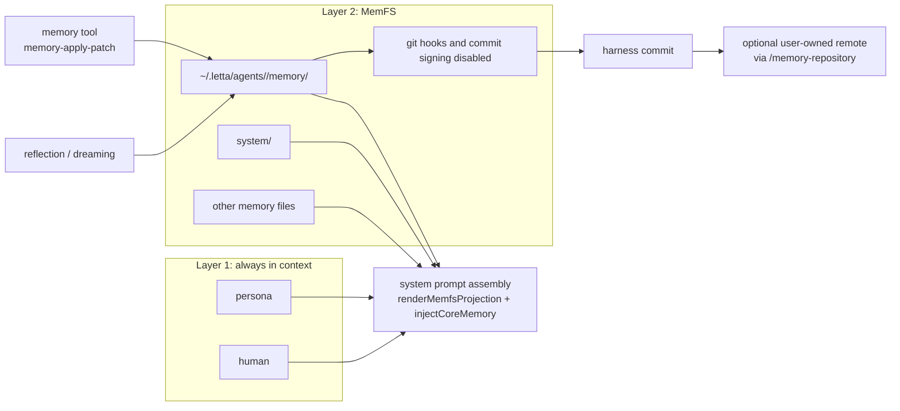

# Memory blocks and the memory filesystem

The Letta agent harness, Letta Code, keeps memory alive for agents that can run for a long time by splitting memory into two layers. The first layer stays tiny and always in context: `persona` and `human` carry identity and relationship context. The second layer lives in MemFS tracked by git and holds the durable material that accumulates over time.

In the v1 server, memory lived closer to a stateful agent loop. As of v2, Letta keeps the same continuity goal but separates prompt seeding from durable storage. For feature-level usage, see [official memory docs](https://docs.letta.com/letta-agent/memory).

## Layer 1: memory blocks

`src/agent/memory.ts` defines the default block labels `persona` and `human`, and it loads them from `src/agent/prompts/persona.mdx` and `src/agent/prompts/human.mdx`. Those MDX files seed the prompt with who the agent is and what it knows about the person it is working with.

These blocks do one job: they keep identity and relationship context near the model on every turn. They do not try to act as a general knowledge store, and the harness treats them as prompt seeding rather than as a user-facing editing surface.

## Layer 2: MemFS

`src/agent/memory-filesystem.ts` scopes each agent's memory to `~/.letta/agents/<agentId>/memory` and creates the `system/` directory that the prompt compiler reads first. That filesystem becomes the durable memory tree for the agent, and the harness enables it for both local and cloud backends.

Git tracking gives the durable layer auditability, rollback, portability, and an optional sync path to a remote the user owns through `/memory-repository`. The git path in `src/agent/memory-git.ts`, `src/agent/memory-git-hooks.ts`, and `src/agent/memory-git-signing.ts` installs pre-commit and post-commit hooks and turns off commit signing for harness-managed identities.

## How memory changes

During a turn, `src/tools/impl/memory.ts` and `src/tools/impl/memory-apply-patch.ts` edit memory files and the harness records the result as a commit. The change stays inside the agent's memory repo, so the model sees the update on the next read without any separate manual sync step.

Outside the turn, reflection and dreaming can also rewrite memory files after a run; see [dreaming and reflection](./04-dreaming-and-reflection.md). In the v1 server, memory often moved through the agent loop itself; v2 keeps the write path explicit and file based.

## How memory is read

`src/backend/local/system-prompt-compilation.ts` renders MemFS with `renderMemfsProjection` and injects the result with `injectCoreMemory`. That path turns the committed filesystem into prompt text before the model sees it.

`src/websocket/listener/turn-setup.ts` rebuilds the current world before each run, while `src/websocket/listener/memfs-sync.ts` pulls MemFS lazily when a listener first sees an agent. Operator surfaces help with inspection, but they stay off the critical path: the `/palace` memory viewers live in `src/cli/components/MemoryTabViewer.tsx`, `src/cli/components/MemfsTreeViewer.tsx`, and `src/web/generate-memory-viewer.ts`, and `/doctor` comes from `src/skills/builtin/context-doctor/SKILL.md`.

## What is shared vs scoped

Agent memory belongs to the agent, not to a single conversation. Every conversation that runs under the same agent reads the same memory, while the conversation queues remain separate. That split lines up with the turn lifecycle in [Anatomy of a turn](./01-anatomy-of-a-turn.md), the queue model in [Conversations, queues, and interrupts](./02-conversations-queues-and-interrupts.md), and the app server boundary in [The app server and the SDK](./08-the-app-server-and-the-sdk.md).

## Where to look in the code

- `src/agent/memory.ts` and `src/agent/prompts/{persona,human}.mdx` define the two seeded memory blocks.
- `src/agent/memory-filesystem.ts` sets the memory root for each agent and creates `system/`.
- `src/agent/memory-git.ts`, `src/agent/memory-git-hooks.ts`, and `src/agent/memory-git-signing.ts` handle clone, pull, commit, hooks, and commit signing.
- `src/tools/impl/memory.ts` and `src/tools/impl/memory-apply-patch.ts` write memory during turns.
- `src/backend/local/system-prompt-compilation.ts`, `src/websocket/listener/turn-setup.ts`, and `src/websocket/listener/memfs-sync.ts` read and hydrate memory at runtime.
- `src/cli/components/MemoryTabViewer.tsx`, `src/cli/components/MemfsTreeViewer.tsx`, `src/cli/commands/memory-repository.ts`, and `src/skills/builtin/context-doctor/SKILL.md` cover operator inspection, remote sync, and audits.
