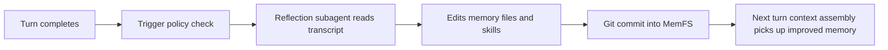

# Dreaming and Reflection

## Overview

Reflection, also called dreaming, moves learning off the hot path. The harness records the turn, then a separate pass rewrites durable memory so later turns can benefit without adding visible latency to the response.

The production subsystem descends from Letta's sleep-time-compute research, and the product term for that background pass is dreaming. This page focuses on mechanics and sits between [03-memory-blocks-and-the-memory-filesystem](./03-memory-blocks-and-the-memory-filesystem.md) and [05-skills-subagents-and-mods](./05-skills-subagents-and-mods.md). For feature-level context, use the official [memory docs](https://docs.letta.com/letta-agent/memory) and [subagents docs](https://docs.letta.com/letta-agent/subagents).

## Why reflection exists

On the hot path, every extra analysis step spends model attention on the current turn and slows the user-facing exchange. Reflection moves that work into a separate pass that can revise memory after the turn completes, when the system can learn without interrupting the conversation.

That split matters because not every useful lesson belongs in the immediate reply. Some lessons describe durable preferences, corrections, or procedures that only help future turns, and background reflection gives those lessons a place to land.

On the hot path, every extra analysis step spends model attention on the current turn and slows the user-facing exchange. Reflection moves that work into a separate pass that can revise memory after the turn completes, when the system can learn without interrupting the conversation.

That split matters because not every useful lesson belongs in the immediate reply. Some lessons describe durable preferences, corrections, or procedures that only help future turns, and background reflection gives those lessons a place to land.

## Harness-side trigger path

When `completeSuccessfulListenerTurn` in `src/websocket/listener/turn-completion.ts` finishes a turn, it appends the transcript delta with `appendTranscriptDeltaJsonl` and then calls `maybeLaunchPostTurnReflection`. That order keeps the trigger honest: the reflection gate sees the just-finished turn in the transcript state instead of guessing from stale context.

`maybeLaunchPostTurnReflection` in `src/cli/helpers/post-turn-reflection.ts` evaluates the settings from `src/cli/helpers/memory-reminder.ts` and decides whether to launch background reflection. The active `ReflectionSettings` and `ReflectionTrigger` types define three modes:

- `off` disables automatic background reflection.
- `step-count` waits until enough completed steps accumulate since the last successful reflection, then launches the pass.
- `compaction-event` waits until compaction or context pressure marks reflection as pending, then launches the pass.

The manual `letta dream` entry point in `src/cli/subcommands/dream.ts` exposes the same subsystem for an explicit run. As of `2026-07-20`, the CLI accepts `--effort` but only reserves the flag; the command prints a note and ignores the value.

## Reflection subagent and MemFS worktree

The worker stays narrow. The manual `letta dream` path defaults to the memory-tuned `letta/auto-memory` model handle. `src/agent/subagents/builtin/reflection.md` limits it to `Bash` and `Edit`, tells it to read the transcript payload from `$TRANSCRIPT_PATH`, and tells it to write only under `$MEMORY_DIR`. The prompt separates durable memory from one-off chatter: it writes facts, preferences, and corrections into memory files, and it creates or updates `skills/` only when the conversation reveals a reusable workflow.

`src/cli/helpers/reflection-launcher.ts` handles the orchestration around that worker. It builds the transcript payload, opens a dedicated reflection worktree, launches the background subagent, and then finalizes the worktree when the run ends. The launcher writes the output into the git-tracked MemFS reflection worktree, then merges it back or leaves it pending based on the worktree result.

`src/agent/memory-worktree.ts` creates the git worktree, commits on a reflection branch, and either merges that branch into the parent memory repo or preserves a pending merge when conflict or manual merge work remains. `src/agent/memory-filesystem.ts` supplies the scoped memory root and the guard behavior that keeps the worker inside the intended checkout.

That git path matters because it keeps memory changes auditable, reviewable, and revertible. The worker does not write opaque runtime state. It writes files, commits them, and hands the result back through git history.

## What reflection produces

Reflection can rewrite memory files and can create or update skill files under `skills/` when it discovers a reusable procedure. Those files give the harness an auditable record of what changed and keep the lesson available for later turns.

When reflection finds a durable correction, it records that correction in files that the harness can inspect later. When it finds a reusable workflow, it promotes that workflow into a skill instead of leaving it buried in a single transcript.

## End to end flow

## The SDK orchestration layer

The programmatic side in `letta-agent-sdk/src/dream/` runs a deeper pipeline than the harness. `dream()` in `src/dream/index.ts` accepts immutable normalized transcript snapshots; it does not discover source stores itself. `src/dream/transcripts.ts` collects and normalizes sessions, `src/dream/batching.ts` packs them into contiguous size-bounded batches, `src/dream/reflect.ts` runs one reflection session per batch on its own clone of the target MemFS with bounded concurrency, and `src/dream/aggregate.ts` synthesizes the batch outputs into the target memory filesystem in one pass.

`src/dream/workers.ts` creates the reflector and aggregator agents, `src/dream/agent.ts` owns the dream-agent state and MemFS policy, and `src/dream/runner.ts` runs each session to completion. `src/dream/prompts.ts` wires the prompt templates together, and `src/dream/prompts/memory-routing-contract.md` tells the worker when to route content into `system/`, `skills/`, or reference memory.

The SDK also manages source selection and long-lived cursors. That makes it useful for backlog-style synthesis and multi-source review, not only for a single post-turn hook. The harness launches one background reflection after a turn, but the SDK can collect many transcript snapshots, process them in parallel, and fold them into one target memory tree.

## Honesty and current limits

- Reflection quality depends on the transcript snapshot and on the worker model.
- Trigger modes trade latency and cost against how quickly the system learns: `off` does nothing automatically, `step-count` waits for a threshold, and `compaction-event` follows context pressure.
- As of `2026-07-20`, the CLI still reserves flags such as `--effort` without implementing them.

## Where to look in the code

- `letta-ai/letta-code`: `src/websocket/listener/turn-completion.ts`, `src/cli/helpers/post-turn-reflection.ts`, `src/cli/helpers/memory-reminder.ts`
- `letta-ai/letta-code`: `src/cli/subcommands/dream.ts`, `src/cli/helpers/reflection-launcher.ts`
- `letta-ai/letta-code`: `src/agent/subagents/builtin/reflection.md`, `src/agent/memory-worktree.ts`, `src/agent/memory-filesystem.ts`
- `letta-ai/letta-agent-sdk`: `src/dream/index.ts`, `src/dream/transcripts.ts`, `src/dream/batching.ts`
- `letta-ai/letta-agent-sdk`: `src/dream/reflect.ts`, `src/dream/aggregate.ts`, `src/dream/workers.ts`, `src/dream/agent.ts`, `src/dream/runner.ts`, `src/dream/prompts.ts`, `src/dream/prompts/memory-routing-contract.md`