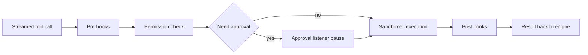

# Tools, permissions, and sandboxing

The Letta agent harness, letta-code, runs client-side tools on the user's machine while the model decides what to ask for next. That split keeps shell state, local files, and scoped memory inside the client boundary, where the harness can enforce permissions and sandboxing before any action reaches a tool. This page follows that path from turn orchestration to execution and back again.

## The design choice

The streamed turn listener in `src/websocket/listener/turn.ts` owns the full loop, and it hands approval stops to `src/websocket/listener/turn-approval.ts` when a tool call needs a pause. The listener also carries the current permission mode through per-conversation state, so the model, the approval path, and the executor all read the same posture during one turn. See [Anatomy of a turn](./01-anatomy-of-a-turn.md) for the broader turn lifecycle.

In v1, the server executed tools; v2 inverted that boundary so local and private environments keep tool side effects on the user's machine.

## The tool layer

The central tool assembly path runs through `src/tools/manager.ts` and `src/tools/toolset.ts`. Those files gather the built-in catalog, layer in the descriptions under `src/tools/descriptions/`, and let `src/mods/tool-registry.ts` extend the surface.

The concrete implementations live under `src/tools/impl/`.

- Execution tools: `Bash` and `Shell` launch terminal commands and carry the heavy work of package installs, scripts, and other shell tasks.
- File tools: `Read`, `Edit`, and `Write` handle direct file work, while the path-oriented search helpers support lookup and targeting.
- Search tools: `Grep` covers content search, and the related path helpers fill the same role when a path filter helps more than a command line.
- Memory tools: `memory` and `memory_apply_patch` operate on the scoped memory filesystem; see [Memory blocks and the memory filesystem](./03-memory-blocks-and-the-memory-filesystem.md).
- Delegation tools: `Task` launches subagents, and `MessageChannel` sends replies back through external channels when a notification arrives.
- Skills: the skill layer stays adjacent to this page, and queued skill content enters the stream through `src/websocket/listener/skill-injection.ts` rather than through a separate memory system.
- Mods: extra tools extend the surface without changing the core catalog.

For the larger extension model around skills, subagents, and mods, see [Skills, subagents, and mods](./05-skills-subagents-and-mods.md).

## The gate sequence

The listener treats a streamed tool call as a gated pipeline. Hooks can observe or block it, permissions can allow or deny it, approval can pause it, and sandboxing can narrow the process that finally runs.

### Pre-hooks

The hook runner calls pre-tool-use hooks before any tool executes. A pre-hook can stop the call early, which keeps policy and environment checks in one place instead of pushing them into each tool. For setup details, see the official [hooks docs](https://docs.letta.com/letta-agent/hooks).

### Permission check

`src/permissions/checker.ts` evaluates the rules stack in a fixed order. Deny rules, CLI disallow rules, always-ask rules, mode overrides, CLI allow rules, working-directory allowances, session rules, settings rules, and mod permissions all feed one decision, and permission-request hooks can still convert an `ask` into an allow or a deny.

### Approval pause

If the checker still needs human input, `src/websocket/listener/turn.ts` hands the stop to `src/websocket/listener/turn-approval.ts`. That code path emits a control request over the websocket, waits for the response, and keeps the approval state inside the turn lifecycle so a resumed stream picks up the same conversation state.

### Sandboxed execution

The harness wraps the launched process only after the earlier gates clear. `src/permissions/sandbox-gate.ts` and `src/permissions/sandbox-policy.ts` decide whether a sandboxed launch can run and which posture it gets, then `src/sandbox/seatbelt.ts` or `src/sandbox/bwrap.ts` adds the backend-specific wrapper around the launcher. When the host cannot support a backend, the code warns and continues with the normal guard layer.

### Post-hooks

Post-tool-use hooks run after execution finishes. They can add follow-up context, but they do not change the tool result that already returned from the client-side executor.

### Result back to the engine

After hooks finish, the listener hands the final result back into the streaming turn and keeps the turn lifecycle in sync. That handoff lets the model continue with the tool outcome instead of with an abstract server-side event.

## The permission model

The permission model combines a mode with a rule stack. `src/permissions/startup.ts` and `src/permissions/cli.ts` set the starting mode, `src/permissions/loader.ts` merges settings from user, project, and local scopes, `src/permissions/session.ts` holds transient allow, deny, ask, and always-ask rules, and `src/mods/permission-registry.ts` adds mod-provided permissions and tool policies. The listener keeps per-conversation mode state in `src/websocket/listener/permission-mode.ts`, and `src/reminders/engine.ts` injects a permission-mode reminder so the model sees the active posture during the turn.

The current mode matters because it can auto-allow broad tool classes or keep the harness in a stricter posture without changing the underlying rules. A surface without an interactive user still runs the same stack, and only a live approval transport can satisfy an `ask` decision. For configuration examples, see the official [permissions docs](https://docs.letta.com/letta-agent/permissions).

## Sandboxing

The harness probes the host before it wraps a launcher. On macOS, `src/sandbox/availability.ts` looks for `sandbox-exec`; on Linux, it checks for `bwrap` and verifies that unprivileged user namespaces actually work; on other platforms it reports that no filesystem sandbox backend exists. Memory-subagent filesystem sandboxing defaults on through `LETTA_FS_SANDBOX`, while cross-agent shell sandboxing stays opt-in so ordinary shell workflows do not break by default.

The memory-subagent path and the shell path solve different problems. `src/agent/subagents/sandbox.ts` constrains a memory-subagent's whole child process so its own writes stay inside the scoped memory surface, while `src/tools/impl/shell-sandbox.ts` constrains shells launched by tools such as Bash and Shell so subprocesses inherit the same cross-agent guard. `src/permissions/sandbox-policy.ts` sets the writable roots and read-only roots for each posture, and `src/sandbox/seatbelt.ts` or `src/sandbox/bwrap.ts` turns that policy into backend-specific arguments for `sandbox-exec` or `bwrap`.

Sandboxing stays best effort, not magical. When the host cannot provide a backend, the harness logs a warning once and keeps running, because the code can only enforce what the environment supports. That keeps the guarantee honest: the client enforces the boundary when a kernel backend exists, and it falls back gracefully when it does not.

## Related seams

Skills, subagents, and mods form the adjacent extension layer, and the turn lifecycle exposes them on every surface that streams a conversation. [The app server and the SDK](./08-the-app-server-and-the-sdk.md) show where that client boundary meets the programmatic SDK, while [Skills, subagents, and mods](./05-skills-subagents-and-mods.md) explains the neighboring extension model.

## Where to look in the code

- `src/tools/manager.ts` and `src/tools/toolset.ts` — assemble the tool catalog and mod extensions.
- `src/hooks/index.ts` and `src/websocket/listener/turn-approval.ts` — observe tool calls and pause for approval.
- `src/permissions/checker.ts`, `src/permissions/mode.ts`, `src/permissions/loader.ts`, and `src/permissions/session.ts` — decide whether a call can run.
- `src/reminders/engine.ts` and `src/websocket/listener/permission-mode.ts` — keep the active permission posture visible during a turn.
- `src/permissions/sandbox-gate.ts`, `src/permissions/sandbox-policy.ts`, and `src/sandbox/availability.ts` — choose whether the host can enter a sandboxed path.
- `src/sandbox/seatbelt.ts`, `src/sandbox/bwrap.ts`, `src/agent/subagents/sandbox.ts`, and `src/tools/impl/shell-sandbox.ts` — apply the backend-specific launch wrappers for subagents and shell tools.