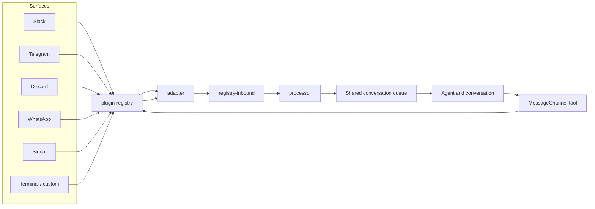

# Channels

Slack, Telegram, Discord, terminal sessions, and the newer channel surfaces all reach the same agent and conversation. Letta keeps identity and memory with the agent and conversation, not with the surface that received the message first. The channels subsystem preserves that boundary and still moves surface traffic through the same conversation machinery as everything else.

A surface is the chat system a person sees. A channel is Letta's integration for that surface. A route binds one chat to one agent conversation. An adapter translates native events into the harness's normalized form and sends replies back out. A turn source records the minimal provenance needed for routing and attribution. The queue holds work when the current turn cannot accept it. Permission mode governs which approvals the conversation accepts.

Related pages:
- [/00-the-big-picture.md](/00-the-big-picture.md)
- [/01-anatomy-of-a-turn.md](/01-anatomy-of-a-turn.md)
- [/02-conversations-queues-and-interrupts.md](/02-conversations-queues-and-interrupts.md)
- [/03-memory-blocks-and-the-memory-filesystem.md](/03-memory-blocks-and-the-memory-filesystem.md)
- [/05-skills-subagents-and-mods.md](/05-skills-subagents-and-mods.md)
- [/06-tools-permissions-and-sandboxing.md](/06-tools-permissions-and-sandboxing.md)
- [/08-the-app-server-and-the-sdk.md](/08-the-app-server-and-the-sdk.md)

## Registry and plugin boundary

The registry layer owns discovery, startup, and routing. `src/channels/plugin-registry.ts` decides which channels exist and loads them, `src/channels/plugin-types.ts` defines the metadata, config schema, and message action contract that plugins expose, and `src/channels/service.ts` gives the rest of the harness a stable facade for account, route, runtime, and snapshot operations. That boundary keeps channel policy in one place even as surface behavior changes.

The bundled first-party plugins live under `src/channels/slack/`, `src/channels/telegram/`, `src/channels/discord/`, `src/channels/whatsapp/`, `src/channels/signal/`, and `src/channels/custom/`. The registry loads those plugins directly.

User-installed plugins sit under `~/.letta/channels/<channel-id>/channel.json`. The loader reads that manifest, resolves the manifest `entry` path relative to the channel directory, and imports the module dynamically. The first-party `custom` plugin stays the explicit extension point: it ships a schema-driven config surface, and it gives headless user plugins a predictable shape.

## Inbound traffic enters the shared conversation path

The adapter stops raw platform payloads at the boundary. `src/channels/registry.ts` wires each adapter's `onMessage` into the registry, `src/channels/registry-inbound.ts` resolves the route and policy, and `src/channels/processor.ts` turns the message into a `ChannelTurnSource` and formatted content. Downstream code never handles the raw Slack, Telegram, Discord, WhatsApp, or Signal envelope; it only sees normalized content plus the minimal provenance needed for routing and attribution.

The diagram keeps one registry boundary in the middle. Inbound traffic crosses it from the left, and proactive outbound work crosses it from the agent side.

## Outbound traffic uses the same boundary in reverse

Outbound delivery reverses the same path. The processor and adapter shape the agent's reply for the target surface, then the adapter sends that payload back to the platform. Telegram uses HTML, Slack uses `mrkdwn`, and Signal uses text styles as examples of per-surface formatting, not as a universal spec. `src/tools/impl/message-channel.ts` gives the agent a proactive tool path: it can send on its own schedule, while each channel plugin keeps action discovery and dispatch underneath one shared tool surface.

## Queueing keeps channel bursts inside one turn

When a channel message arrives mid turn, the listener usually queues it behind active work instead of interleaving it. The queue runtime can coalesce compatible items into one payload, so a burst of messages stays attached to one turn when the scope matches. `src/websocket/listener/inbound-dispatch.ts` decides whether to process immediately or enqueue, `src/websocket/listener/queue.ts` pumps queued work, and `src/queue/queue-runtime.ts` with `src/queue/turn-queue-runtime.ts` define the coalescing behavior that the agent sees.

## Permission mode follows the conversation

Permission mode belongs to the conversation, not the surface. The listener keeps it on the long-lived runtime, writes it to remote settings, and checks it together with pending control requests and turn lifecycle state before it opens the next turn. That keeps approval behavior stable across reconnects and across surfaces.

> Note: This reflects the mid-2026 codebase. Slack, Telegram, and Discord are the most established paths; WhatsApp and Signal are newer; `custom` remains the schema-driven extension point. Channel maturity stays uneven, so the registry covers more than any single adapter family.

## Where to look in the code

- `src/channels/registry.ts` — registry singleton, adapter startup, and ingress handoff.
- `src/channels/plugin-registry.ts` — bundled and user plugin discovery.
- `src/channels/registry-inbound.ts` — route resolution, policy checks, and inbound normalization.
- `src/channels/processor.ts` — turn source construction and message formatting.
- `src/tools/impl/message-channel.ts` — proactive outbound tool surface and channel-specific formatting.
- `src/websocket/listener/queue.ts`, `src/queue/queue-runtime.ts`, `src/queue/turn-queue-runtime.ts`, `src/websocket/listener/permission-mode.ts` — queueing, coalescing, and conversation permission state.