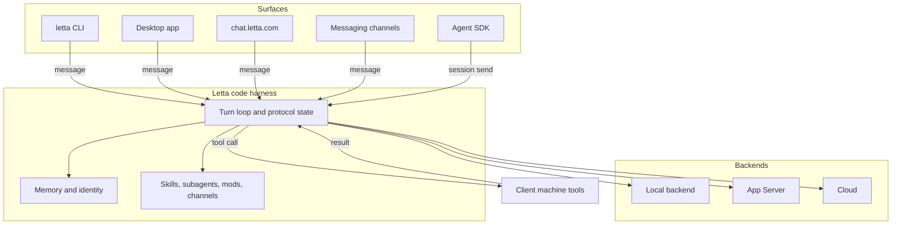

The current Letta v2 system lives in two pieces: the `letta-code` harness and the `letta-agent-sdk` protocol and session seam. Together they keep one conversation coherent across the `letta` CLI, the desktop app, `chat.letta.com`, messaging channels, and the Agent SDK. The old MemGPT-era Python server provides historical context, but it does not define the current shape.

## What Letta is for

Letta gives an agent a durable conversation, a memory store, and a controlled way to reach tools and external surfaces. It keeps the active turn close to the user while it preserves the agent's identity and memory across sessions and surfaces. That is the core promise: the conversation continues, even when the front end, transport, or session handle changes.

## Client and server split

The harness owns the turn. The client owns the surface that sends the message and, when a tool call demands it, the machine that runs the tool. The Agent SDK talks to that seam instead of duplicating the harness, and `src/app-server-client.ts` shows the same control and stream split that the protocol expects.

The same model runs across three deployment backends: local, App Server, and cloud. The backend changes where the harness runs and who starts it, but it does not change the conversation model or the turn contract.

## Turn loop at map altitude

The turn loop starts by rebuilding the current world, not by trusting the last reply to carry forward the right state. `src/websocket/listener/turn-setup.ts` gathers reminders, recent context, permission posture, and turn-scoped tools before the model sees the next message. `src/queue/turn-queue-runtime.ts` keeps queued input in order and merges compatible items into one payload when a conversation needs a single turn.

`src/types/protocol_v2.ts` names the loop states that the surfaces see: waiting on input, waiting on approval, executing a client-side tool, and returning to the idle edge of the next turn. `src/websocket/listener/turn-lifecycle.ts` keeps that state machine honest, while `src/websocket/listener/protocol-outbound.ts` publishes loop status, queue snapshots, device status, and subagent state so the surface sees the live shape of the turn.

For the turn-level path from input to reply, see [Anatomy of a Turn](./01-anatomy-of-a-turn.md).

## Memory and identity

Identity belongs to the agent and conversation, not to a session handle or a surface. The memory filesystem keeps that identity rooted in a scoped agent directory, and `src/agent/memory-filesystem.ts` resolves the memory path from the current agent, the local backend, or the active environment. That gives the harness one durable place for memory while sessions come and go around it.

The turn setup path rebuilds reminders and tool context from that durable state at the start of each turn. The result keeps memory visible without turning memory into a separate runtime. For the filesystem layout and the MemFS rules, see [Memory blocks and the memory filesystem](./03-memory-blocks-and-the-memory-filesystem.md).

## Extension mechanisms

Letta keeps the extension boundaries separate on purpose.

- Skills, subagents, and mods keep different boundaries: skills add prompt-time guidance and reusable procedure, subagents move scoped work out of the main turn, and mods extend the host harness with tools, permissions, commands, and other local capabilities. See [Skills, subagents, and mods](./05-skills-subagents-and-mods.md) and `src/mods/mod-engine.ts`.
- Channels connect outside surfaces back to the same conversation model. See [Channels](./07-channels.md).
- The Agent SDK keeps the app-server/session seam stable for programmatic clients. See [The App Server and the SDK](./08-the-app-server-and-the-sdk.md).

`src/tools/manager.ts` decides which tools the model sees, which ones the harness can execute locally, and which ones need approval. `src/channels/registry.ts` routes messages from external surfaces into the same turn machinery, and `src/app-server-client.ts` keeps the control and stream sides of the app-server connection separate.

## Dated comparison with v1

The MemGPT-era Python server treated the server as the center of gravity. Letta v2 moves that center into the harness and the SDK seam. The current design keeps turn orchestration, protocol state, and extension routing in `letta-code`, while `letta-agent-sdk` provides the client-facing session boundary.

That change matters because it keeps tool execution and local side effects on the client machine while the conversation model stays stable across surfaces. The older server still helps explain the history, but it does not describe the current architecture. For the protocol seam that carries that split, see [The App Server and the SDK](./08-the-app-server-and-the-sdk.md).

## Honesty note

This guide reflects a dated snapshot of the v2 system. Exact inventories, surface support, and experimental paths can move, but the core shape stays the same: one conversation, one agent identity, one turn loop, and one SDK seam.

## Where to look in the code

- `letta-code` `src/backend/backend.ts`, `src/backend/local/local-backend.ts` — backend capability split and local execution path.
- `letta-code` `src/types/protocol_v2.ts`, `src/websocket/listener/turn-setup.ts`, `src/websocket/listener/turn-lifecycle.ts`, `src/websocket/listener/protocol-outbound.ts` — loop states, turn setup, lifecycle, and outbound state.
- `letta-code` `src/queue/turn-queue-runtime.ts`, `src/agent/memory-filesystem.ts` — queue merging and scoped memory paths.
- `letta-code` `src/tools/manager.ts`, `src/mods/mod-engine.ts` — local tool assembly and host extension loading.
- `letta-code` `src/channels/registry.ts`, `src/app-server-client.ts` — channel routing and app-server transport.
- `letta-agent-sdk` `src/protocol.ts`, `src/session.ts`, `src/app-server-session.ts` — protocol definitions, session lifecycle, and SDK-owned app-server startup.