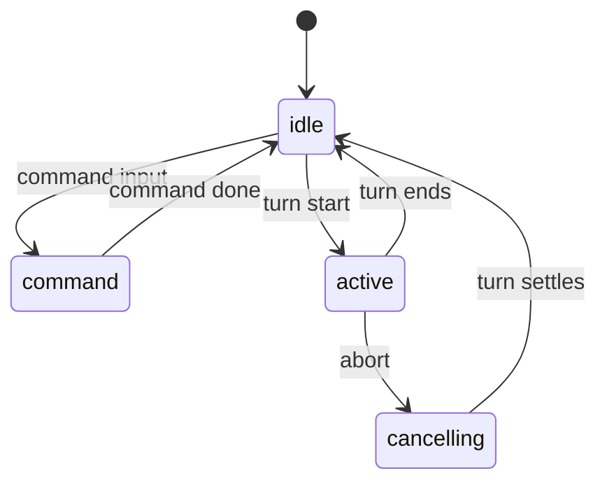

The agent harness keeps durable agent memory separate from conversation-scoped execution state. The [memory page](/letta-agent/memory) covers that boundary; this page focuses on how a single agent owns many conversations, how each conversation serializes turn work, and how interrupts and scheduled work enter the same flow.

## One agent, many conversations

The listener treats the agent as a long-lived identity and the conversation as the unit of execution. A single agent can own many conversations at once, but each conversation keeps its own queue, its own turn lifecycle, and its own live interruption state.

That split matters because durable memory does not sit inside the turn loop. The conversation runtime carries the transient state that matters for the current thread: queue depth, active turn ownership, pending approvals, interrupted results, and the current loop status. The agent-level state survives across conversations; the conversation-level state drains and resets as turns complete.

## Queue serialization

The listener attaches a `QueueRuntime` to each `ConversationRuntime`, so every inbound source converges on the same ordered queue for that conversation. Inbound user messages, task notifications, cron prompts, and mod continuations all enter that queue before the listener starts a turn.

The queue layer coalesces turn-starting items when they share the same conversation scope. That merge step lets the listener gather a burst of related work into one turn instead of starting several tiny turns back to back. The important queue kinds are:

- `message` for user input.
- `task_notification` for task-driven follow-up.
- `cron_prompt` for scheduled work.
- `mod_continue` for a continuation that behaves like user text.
- `approval_result` for control results that stay ordered but do not join the turn-starting batch.
- `overlay_action` for overlay-side actions that also serialize through the same queue.

The last two kinds matter because they still move through the same serialized line even though the turn merger does not fold them into the batch that starts a new turn. That design keeps queue order stable while preserving the difference between fresh user input and control data that steers a turn already in flight.

## Turn lifecycle and lease ownership

`TurnLifecycle` defines the canonical `idle`, `command`, `active`, and `cancelling` states. `idle` means no local owner holds the conversation. `command` covers synchronous command work that owns the conversation before a turn begins. `active` marks a live turn with a lease, a run id, and a set of executing tool calls. `cancelling` keeps the same lease alive while the live turn winds down after an abort.

The distinction between `command` and `active` keeps setup work separate from model execution. The distinction between `cancelling` and `idle` matters just as much: `cancelling` still blocks new ownership until the old lease settles, while `idle` says the conversation can accept new work.

The lease rule sits at the center of that model. Only one runtime may own a conversation turn flow at a time, and every state mutation after an await must check that the lease still belongs to the caller. A stale lease emits nothing and mutates nothing. That rule keeps the queue, the loop status, and the terminal state aligned even when work resumes after a delay.

## How live turns move

A live turn keeps accepting steering input while it runs. Ordinary follow-up input queues behind the current work, and the queue pump drains that input when the lease allows it. Interrupt and control paths can normalize tool-return data or approval responses into the interrupted turn, so the next continuation sees the same conversation thread instead of a disconnected retry.

Explicit aborts request cancellation. The listener projects that request through the same lifecycle that governs the turn, so the live surfaces stay honest while the abort runs through the system. Queue depth updates continue to reflect waiting work, loop-status updates show the current state of the turn, and the UI can surface interrupted or cancelled transitions as they happen.

The implementation keeps those live surfaces separate on purpose. The queue reports what waits. The lifecycle reports who owns the conversation. Interrupt handling translates in-flight tool or approval state into data that the interrupted turn can consume. That separation keeps steering predictable even when a turn pauses, resumes, or exits under cancellation.

## Self-scheduling

The cron scheduler runs in process, claims its own lease, and ticks once per minute. On each tick it checks the active cron file, finds matching work, and hands that work into the same conversation queue used by user input and task notifications.

That design keeps proactive work on the same path as ordinary inbound work. Crons, scheduled tasks, and reflection each represent intentional activity, not a transport heartbeat or an old background think loop. The scheduler only decides when to enqueue the work; the conversation queue and turn lifecycle decide when the work can start.

The scheduler also keeps its own file-backed ownership rule. One process claims the lease, another process yields, and stale ownership gets recovered before tasks fire. That matches the rest of the listener model: a single owner governs a single flow, and the queue stays the source of truth for what runs next.

## Where to look in the code

- `src/websocket/listener/runtime.ts` and `src/websocket/listener/types.ts` keep agent identity separate from conversation-scoped runtime state.
- `src/websocket/listener/turn-lifecycle.ts` and `src/websocket/listener/AGENTS.md` define the `idle`, `command`, `active`, and `cancelling` model and the lease rule.
- `src/queue/queue-runtime.ts`, `src/queue/turn-queue-runtime.ts`, and `src/websocket/listener/queue.ts` handle queue ordering, coalescing, and queue pump behavior.
- `src/websocket/listener/inbound-queue.ts` and `src/websocket/listener/inbound-dispatch.ts` decide when inbound work enters the queue and when it runs immediately.
- `src/websocket/listener/interrupts.ts`, `src/websocket/listener/control-inputs.ts`, `src/websocket/listener/continuation-input.ts`, and `src/websocket/listener/turn-terminal.ts` handle interruption, cancellation, and terminal projection.
- `src/cron/scheduler.ts`, `src/cron/cron-file.ts`, and `src/cron/parse-interval.ts` implement proactive scheduling and the lease-backed cron file model.

For the broader site map and the adjacent field-guide pages, see [Anatomy of a Turn](01-anatomy-of-a-turn.md), [Dreaming and Reflection](04-dreaming-and-reflection.md), and the [protocol lifecycle page](/letta-agent/app-server/protocol-lifecycle).