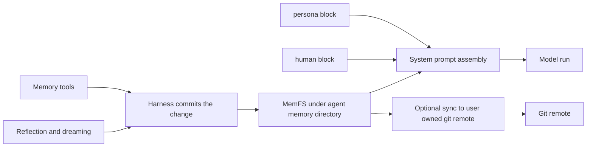

The Letta agent harness, `letta-code`, keeps memory because an agent can run for a long time and still need stable identity, preferences, and working context. The current v2 design splits that memory into two layers: tiny blocks that stay in the system prompt and a git-tracked `MemFS` tree that holds the durable record. The older v1 Memory Blocks and Stateful Agents model belongs to the previous server lineage, not the current harness. For feature-level usage, see the official memory docs at [docs.letta.com/letta-agent/memory](https://docs.letta.com/letta-agent/memory).

## The two memory layers

### Layer one: always in context blocks

`src/agent/memory.ts` defines two default block labels, `persona` and `human`. The harness seeds those blocks from `src/agent/prompts/persona.mdx` and `src/agent/prompts/human.mdx`, so the agent starts each run with the same identity and relationship context.

These blocks do not act as a general knowledge store. They carry the small amount of information that must remain visible on every turn, such as who the agent is and how it should relate to the person or system it serves. The harness manages that seeding path; it does not expose the blocks as a broad user editing surface.

### Layer two: the MemFS filesystem

`src/agent/memory-filesystem.ts` scopes memory to `~/.letta/agents/<agentId>/memory`, creates the `system/` directory, and enables MemFS for both local and cloud backends. That directory becomes the durable working set for the agent, with files that can change over time and survive individual conversations.

`MemFS` stays useful because the harness tracks it in git. `src/agent/memory-git.ts`, `src/agent/memory-git-hooks.ts`, and `src/agent/memory-git-signing.ts` show the supporting pieces: the harness installs pre and post commit hooks, records memory changes as commits, and disables commit signing for harness managed identities. That gives memory auditability, rollback, portability, and optional sync to a user owned remote through `/memory-repository`.

## How memory changes

The in-turn write path runs through `src/tools/impl/memory.ts` and `src/tools/impl/memory-apply-patch.ts`. Those tools edit memory files during a turn, and the harness commits the result after the edit lands. The agent therefore treats memory updates as ordinary file changes, not as a special side channel.

Reflection and dreaming can also rewrite memory files after a turn. `./04-dreaming-and-reflection.md` covers that background. In the v1 server, memory lived closer to the agent heartbeat loop; v2 moves durable state into git-backed files and keeps the always in context blocks tiny.

## How memory enters a turn

`src/backend/local/system-prompt-compilation.ts` composes the runtime prompt for the local backend. It uses `renderMemfsProjection` and `injectCoreMemory` to fold the MemFS view into the system prompt before the model runs. That keeps the prompt assembly path grounded in the same files that store the durable memory.

`src/websocket/listener/turn-setup.ts` rebuilds the current world before a run starts, and `src/websocket/listener/memfs-sync.ts` syncs MemFS lazily the first time a listener sees an agent. That split keeps the turn path fresh without forcing every listener to preload every memory tree.

The operator surfaces sit beside, not inside, that runtime path. `src/cli/components/MemoryTabViewer.tsx` and `src/cli/components/MemfsTreeViewer.tsx` expose memory under the `/palace` anchor, and `src/skills/builtin/context-doctor/SKILL.md` exposes the `/doctor` audit surface. Those views help operators inspect state; they do not define how the model reads memory during a turn.

## Shared across conversations, scoped to an agent

Agent memory follows the agent across conversations. Conversation queues stay separate, so memory does not belong to a single chat transcript or a single turn record. `./01-anatomy-of-a-turn.md` and `./02-conversations-queues-and-interrupts.md` cover the turn and queue layers that move input through the system. `./08-the-app-server-and-the-sdk.md` covers the websocket seam that can reach the same agent state from another surface.

## Where to look in the code

- `src/agent/memory.ts`, `src/agent/prompts/persona.mdx`, and `src/agent/prompts/human.mdx` define the tiny always in context blocks.
- `src/agent/memory-filesystem.ts`, `src/agent/memory-git.ts`, `src/agent/memory-git-hooks.ts`, and `src/agent/memory-git-signing.ts` define the filesystem root, git tracking, hooks, and signing behavior.
- `src/tools/impl/memory.ts` and `src/tools/impl/memory-apply-patch.ts` handle in-turn memory edits.
- `src/backend/local/system-prompt-compilation.ts` and `src/websocket/listener/turn-setup.ts` show how the harness rebuilds context before a run.
- `src/websocket/listener/memfs-sync.ts`, `src/cli/components/MemoryTabViewer.tsx`, `src/cli/components/MemfsTreeViewer.tsx`, `src/skills/builtin/context-doctor/SKILL.md`, and `src/cli/commands/memory-repository.ts` cover sync and observability paths.