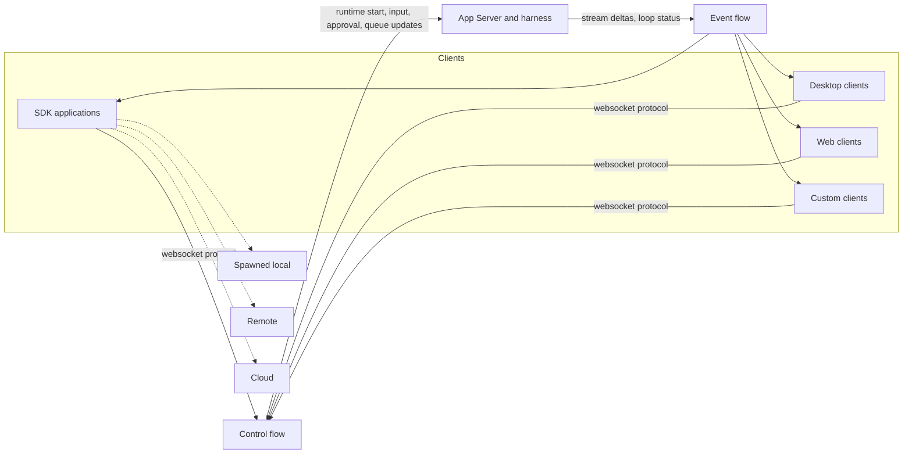

The Letta agent harness, `letta-code`, exposes an App Server so desktop, web, SDK, and custom clients can drive agents without embedding the harness. The Letta Agent SDK, `letta-agent-sdk`, treats that server as the programmatic seam and keeps one session model while the runtime moves between local, remote, and cloud setups.

## The App Server seam

In `letta-code`, `src/websocket/app-server.ts` starts a websocket server and `src/cli/subcommands/app-server.ts` exposes it through the `letta app-server` command. The server returns separate control and stream URLs, and the code keeps those channels distinct. The control channel carries runtime setup, inputs, approvals, and other commands that need a direct reply. The stream channel carries live turn output and state changes that observers need while a turn runs.

The heartbeat in `src/websocket/app-server.ts` watches transport liveness only. It pings connected sockets and reaps dead connections so a stalled client does not hold the control slot forever. It does not advance a turn or create any agent work. Authentication in `src/websocket/app-server-auth.ts` sits at the websocket upgrade boundary. Loopback listeners can run open, while non loopback listeners require either a capability token or a signed bearer token.

## How the seam maps to a turn

This seam matches the lifecycle in [The anatomy of a turn](./01-anatomy-of-a-turn.md) and [Conversations, queues, and interrupts](./02-conversations-queues-and-interrupts.md). The harness accepts new input into the conversation queue, reports loop status as the turn moves between waiting, processing, and approval states, streams message deltas across the event channel, and emits queue updates when a message arrives while another turn still owns the runtime. Approval requests and decisions travel on the same seam, so the observer sees both the question and the answer without leaving the turn context.

## The SDK as a client

In `letta-agent-sdk`, `src/client.ts` selects the backend and returns session objects. The SDK does not reimplement the engine; it speaks the same websocket protocol and wraps the harness behavior in a stable client API. The three backends describe deployment, not a different programming model.

- Local: `src/local-app-server.ts` spawns an SDK owned App Server process. The SDK still uses the websocket protocol, but it also owns the harness process.
- Remote: the SDK connects to a user-run App Server and leaves process ownership outside the client.
- Cloud: Letta Cloud and Constellation manage the runtime, sandboxes, and repository attachment, while the SDK keeps the same session surface.

Across all three, the session API and the protocol stay the same. What changes is who runs the harness and where tools execute.

## Sessions and turn ownership

The session abstraction in `src/session.ts` and `src/remote-client-session-core.ts` treats a session as an attachment to one conversation. The agent itself outlives any one session handle, and a resumed session simply reattaches to the same agent or conversation. A session starts work, streams events during the turn, and then ends or stays open for the next turn.

The SDK keeps mid turn behavior visible rather than hidden. When new input arrives while a turn runs, the runtime queues it and the SDK reports that state through queue update events. When the caller aborts, the SDK interrupts the active turn instead of waiting for it to finish. That makes sessions disposable handles, not the long lived identity of the agent.

`src/app-server-session.ts` carries the App Server specific wiring, while `src/cloud-session.ts` adds the cloud runtime and sandbox lifecycle. Those classes keep the same session shape but adapt the startup path and cleanup path to the backend that owns the harness.

## Repository resources

`src/repositories.ts` gives the SDK a cloud repository client. In cloud mode, the SDK treats repositories as git repositories that the runtime materializes into the agent environment. After attachment, the agent reaches that content through ordinary filesystem tools rather than through a separate search index.

In the v1 server, repository content lived behind embedding backed folders and document search. As of v2, the seam moves to repository materialization and file access, which keeps the agent closer to the source material. For the broader v1 to v2 shift, see [The big picture](./00-the-big-picture.md).

## Scope note

The SDK also hosts batch dreaming orchestration; see [Dreaming and reflection](./04-dreaming-and-reflection.md). The in process local engine remains experimental as of mid 2026, and the App Server path remains the supported self hosted route.

## Architecture sketch

## Where to look in the code

- `letta-code` `src/websocket/app-server.ts` — websocket server, split channels, session setup, and transport liveness.
- `letta-code` `src/websocket/app-server-auth.ts` — websocket upgrade auth for loopback, capability tokens, and signed bearer tokens.
- `letta-code` `src/types/protocol_v2.ts` — runtime scoped control, queue, loop status, and stream delta contracts.
- `letta-code` `src/cli/subcommands/app-server.ts` — CLI entry point that starts the App Server and prints its URLs.
- `letta-agent-sdk` `src/client.ts` — backend selection and session construction.
- `letta-agent-sdk` `src/app-server-session.ts`, `src/remote-client-session-core.ts`, `src/cloud-session.ts`, `src/repositories.ts` — session wiring, turn tracking, cloud runtime, and repository resources.